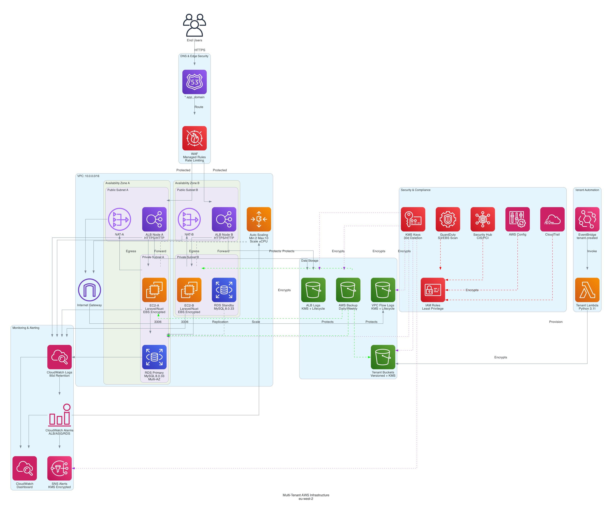
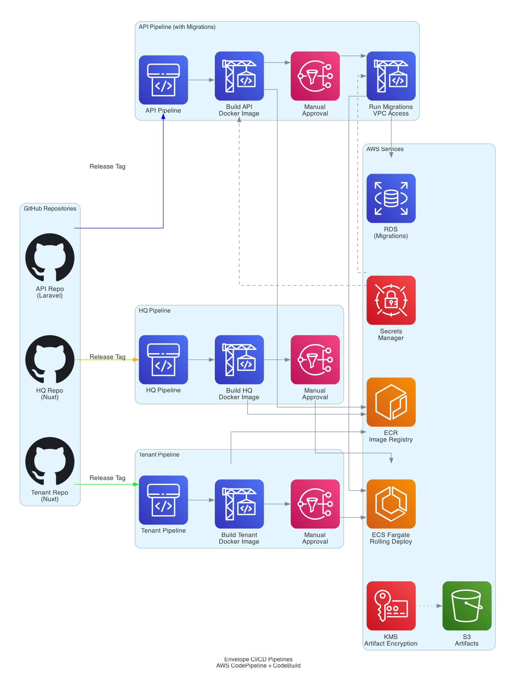

# Security & Compliance Overview
## For Enterprise Clients & IT Security Teams

**Date:** December 2025
**Confidentiality:** Public / Client Distribution
**System:** Envelope Multi-Tenant SaaS Platform

---

## 1. Executive Summary

This document provides a comprehensive overview of the security, compliance, and infrastructure architecture of the Envelope platform. It is designed to assist IT and Security teams during vendor risk assessment and onboarding processes.

Our platform is built on **AWS (Amazon Web Services)** using an **ISO 27001:2022 compliant architecture**. We prioritize data sovereignty, security, and availability to meet the rigorous standards of blue-chip enterprise clients in the UK and EU.

### Key Certifications & Standards
- **Infrastructure Provider:** AWS (ISO 27001, SOC 2 Type II, PCI DSS Level 1)
- **Data Residency:** UK Only (London Region: `eu-west-2`)
- **Compliance Framework:** Aligned with ISO/IEC 27001:2022 and UK GDPR

---

## 2. Infrastructure & Security Architecture

### 2.1 Hosting & Data Residency
All customer data is stored and processed exclusively within the **United Kingdom (AWS London Region / eu-west-2)**. We do not transfer personal data outside the UK/EEA without explicit data processing agreements and adequacy safeguards.

### 2.2 Network Security
Our network architecture utilizes a **Defense-in-Depth** strategy:
- **WAF (Web Application Firewall):** Protects against OWASP Top 10 threats, SQL injection, and XSS.
- **VPC Isolation:** All application and database workloads run in private subnets with no public internet access.
- **Encryption in Transit:** All data transmission is encrypted via **TLS 1.2+** (HTTPS) using strong cipher suites.
- **DDoS Protection:** AWS Shield Standard protects against network and transport layer attacks.

### 2.3 Compute Security
We utilize **AWS Fargate** (Serverless Compute) to minimize the attack surface:
- **OS Patching:** Managed directly by AWS, ensuring critical security patches are applied immediately.
- **Immutable Infrastructure:** Containers are replaced, not patched, preventing configuration drift.
- **Malware Scanning:** Automated scanning of uploaded files via S3 Event triggers (using ClamAV).

*Figure 1: High-level infrastructure showing network segmentation and security layers.*

---

## 3. Data Protection & GDPR Compliance

We are fully committed to UK GDPR compliance and acting as a responsible Data Processor.

### 3.1 Data Encryption
- **Encryption at Rest:** All data stores (Database, S3, Redis, Backups) are encrypted using **AES-256** via AWS KMS (Key Management Service).
- **Key Management:** Cryptographic keys are rotated annually and managed with strict IAM policies.

### 3.2 Tenant Isolation
To ensure **data segregation** in our multi-tenant environment:
- **Logical Isolation:** Row-level security enforces tenant boundaries at the database layer.
- **Storage Isolation:** Each tenant is provisioned a **dedicated S3 bucket** with unique IAM access policies.
- **Access Control:** Strict authorization checks prevent cross-tenant data access.

### 3.3 Data Subject Rights
We provide tools and processes to support your GDPR obligations:
- **Right to Erasure:** Automated workflows to securely delete all tenant data upon contract termination.
- **Data Portability:** Export features allow retrieval of customer data in standard formats (JSON/CSV).
- **Sub-processors:** Our only sub-processor is AWS (infrastructure). Any changes are communicated with 30 days' notice.

---

## 4. Access Control & Identity Management

We offer enterprise-grade identity features to integrate seamlessly with your corporate security policies.

### 4.1 Single Sign-On (SSO)
- **Microsoft 365 / Azure AD Integration:** We support SAML 2.0 / OIDC integration, allowing your staff to log in using their existing corporate credentials.
- **Just-in-Time Provisioning:** User accounts can be automatically created upon first successful SSO login.

### 4.2 Multi-Factor Authentication (MFA)
- **Enforced MFA:** We support and can enforce MFA for all native logins (TOTP apps like Google/Microsoft Authenticator).
- **Adaptive Security:** Suspicious login attempts (e.g., new device, new location) trigger additional verification.

### 4.3 Custom Roles & Permissions (RBAC)
Our **Role-Based Access Control (RBAC)** system allows granular permission management:
- **Pre-defined Roles:** Admin, Editor, Viewer, Auditor.
- **Custom Roles:** Create bespoke roles with specific permission sets (e.g., "Finance User" with billing access only).
- **Audit Logs:** All permission changes and access events are logged.

---

## 5. Business Continuity & Disaster Recovery

We maintain a robust Business Continuity Plan (BCP) to ensure service resilience.

### 5.1 High Availability
- **Multi-AZ Deployment:** All critical components (Database, App Servers, Load Balancers) are replicated across multiple Availability Zones (physically separated data centers) within London.
- **SLA:** We target a **99.9% uptime** SLA.

### 5.2 Backup Strategy
- **Frequency:**
  - **Database:** Continuous backup (Point-in-Time Recovery) + Daily snapshots.
  - **Files:** Versioned storage + Daily backup.
- **Retention:** Daily backups retained for 30 days; Monthly for 1 year.
- **Location:** Backups are stored in a separate, isolated S3 vault (AWS Backup) to protect against ransomware.

### 5.3 Disaster Recovery (DR)
- **RTO (Recovery Time Objective):** 4 Hours.
- **RPO (Recovery Point Objective):** 1 Hour.
- **Testing:** Disaster recovery procedures are tested annually.

---

## 6. Incident Management & Support

### 6.1 Monitoring
- **24/7 Monitoring:** Automated systems monitor infrastructure health, performance, and security events.
- **Intrusion Detection:** AWS GuardDuty analyzes logs for threat patterns (e.g., unusual API calls, compromised credentials).

### 6.2 Incident Response
In the event of a security incident:
1. **Detection:** Alerts trigger immediate investigation by our Security Team.
2. **Containment:** Automated or manual isolation of affected systems.
3. **Notification:** Customers are notified within **24 hours** of any confirmed data breach affecting their data (per GDPR Art. 33).

---

## 7. Development & Supply Chain Security

- **Secure Development Lifecycle (SDLC):** Code is peer-reviewed and scanned for vulnerabilities (SAST) before deployment.
- **Dependency Scanning:** Automated tools track and alert on vulnerabilities in third-party libraries.
- **CI/CD Pipelines:** Deployments are fully automated via AWS CodePipeline, ensuring consistency and auditability.

*Figure 2: Secure CI/CD pipeline ensures only approved code reaches production.*

---

## 8. Compliance Documentation Available

Upon request (under NDA), we can provide:
- Full Information Security Policy
- Data Processing Agreement (DPA)
- Penetration Test Summaries
- Business Continuity Plan (BCP) Summary

---

**Contact Information**
For further security enquiries, please contact our Data Protection Officer:
**Email:** security@epact.co.uk
**Address:** International House, 36-38 Cornhill, London, EC3V 3NG
