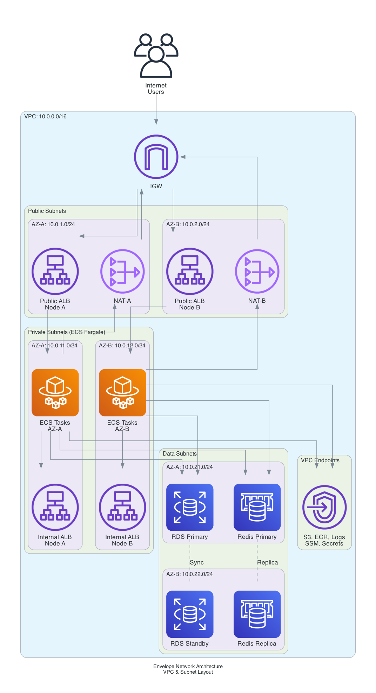
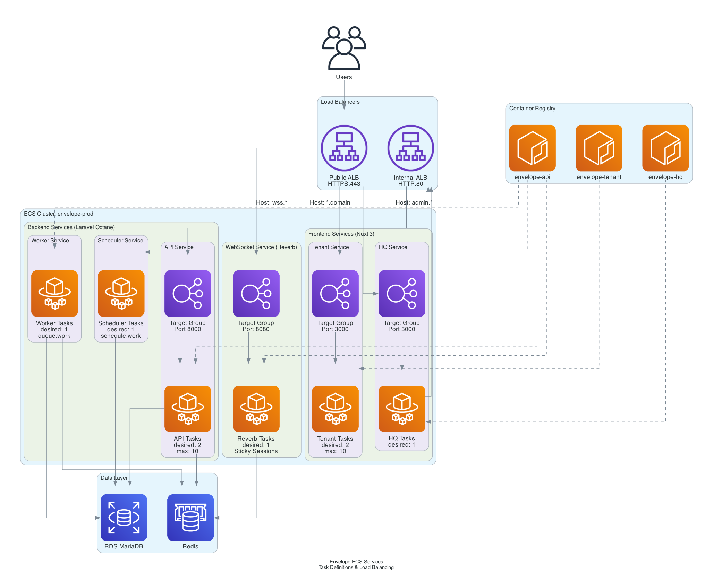

# Infrastructure Architecture

## Overview

Envelope runs on AWS using ECS Fargate for containerized workloads, with RDS MariaDB and ElastiCache Redis for data persistence.

---

## Architecture Diagrams

### Main Infrastructure


*Shows the complete AWS infrastructure including VPC, ECS services, databases, and monitoring.*

### CI/CD Pipelines


*Shows the three independent deployment pipelines for API, Tenant, and HQ repositories.*

### Network Architecture



*Shows the VPC layout with public, private, and data subnets across availability zones.*

### ECS Services



*Shows ECS services, target groups, and container configuration.*

> **Regenerate diagrams**: `python docs/diagrams/generate_aws_diagram.py`

---

## Text Diagrams

### Infrastructure Overview

```
┌─────────────────────────────────────────────────────────────────────────────┐
│                         Envelope AWS Infrastructure                          │
├─────────────────────────────────────────────────────────────────────────────┤
│                                                                              │
│                              ┌──────────────┐                                │
│                              │    Users     │                                │
│                              └──────┬───────┘                                │
│                                     │ HTTPS                                  │
│                              ┌──────▼───────┐                                │
│                              │  Cloudflare  │                                │
│                              │  Route53/WAF │                                │
│                              └──────┬───────┘                                │
│                                     │                                        │
│  ┌──────────────────────────────────┼──────────────────────────────────────┐ │
│  │                          VPC: 10.0.0.0/16                               │ │
│  │                                  │                                      │ │
│  │   ┌─────────────────────────────────────────────────────────────────┐   │ │
│  │   │                     PUBLIC SUBNETS                               │   │ │
│  │   │                                                                  │   │ │
│  │   │     ┌─────────────┐              ┌─────────────┐                │   │ │
│  │   │     │  NAT GW (A) │              │  NAT GW (B) │                │   │ │
│  │   │     └─────────────┘              └─────────────┘                │   │ │
│  │   │                                                                  │   │ │
│  │   │                    ┌───────────────────┐                        │   │ │
│  │   │                    │    PUBLIC ALB     │                        │   │ │
│  │   │                    │    HTTPS:443      │                        │   │ │
│  │   │                    └─────────┬─────────┘                        │   │ │
│  │   └──────────────────────────────┼──────────────────────────────────┘   │ │
│  │                                  │                                      │ │
│  │   ┌──────────────────────────────┼──────────────────────────────────┐   │ │
│  │   │                     PRIVATE SUBNETS                              │   │ │
│  │   │           ┌──────────────────┴──────────────────┐               │   │ │
│  │   │           │                                     │               │   │ │
│  │   │    ┌──────▼──────┐                    ┌─────────▼────────┐      │   │ │
│  │   │    │   Tenant    │                    │       HQ         │      │   │ │
│  │   │    │   Nuxt 3    │                    │     Nuxt 3       │      │   │ │
│  │   │    │   (x2)      │                    │     (x1)         │      │   │ │
│  │   │    └──────┬──────┘                    └─────────┬────────┘      │   │ │
│  │   │           │                                     │               │   │ │
│  │   │           └──────────────┬──────────────────────┘               │   │ │
│  │   │                          │                                      │   │ │
│  │   │                 ┌────────▼────────┐                             │   │ │
│  │   │                 │  INTERNAL ALB   │                             │   │ │
│  │   │                 │    HTTP:80      │                             │   │ │
│  │   │                 └────────┬────────┘                             │   │ │
│  │   │                          │                                      │   │ │
│  │   │    ┌─────────────────────┼─────────────────────┐                │   │ │
│  │   │    │                     │                     │                │   │ │
│  │   │ ┌──▼───┐  ┌──────────┐ ┌─▼────────┐  ┌────────▼─┐               │   │ │
│  │   │ │ API  │  │  Worker  │ │Scheduler │  │  Reverb  │               │   │ │
│  │   │ │Laravel│  │  Queue  │ │  Cron    │  │WebSocket │               │   │ │
│  │   │ │ (x2) │  │  (x1)   │ │  (x1)    │  │  (x1)    │               │   │ │
│  │   │ └──┬───┘  └────┬────┘ └────┬─────┘  └────┬─────┘               │   │ │
│  │   └────┼───────────┼───────────┼─────────────┼──────────────────────┘   │ │
│  │        │           │           │             │                          │ │
│  │   ┌────┼───────────┼───────────┼─────────────┼──────────────────────┐   │ │
│  │   │    │        DATA SUBNETS   │             │                      │   │ │
│  │   │    │           │           │             │                      │   │ │
│  │   │    │     ┌─────▼─────┐     │       ┌─────▼─────┐                │   │ │
│  │   │    └────►│    RDS    │◄────┘       │   Redis   │◄───────────────┘   │ │
│  │   │          │  MariaDB  │             │ElastiCache│                    │ │
│  │   │          │ Multi-AZ  │             │ Multi-AZ  │                    │ │
│  │   │          └───────────┘             └───────────┘                    │ │
│  │   └─────────────────────────────────────────────────────────────────┘   │ │
│  └─────────────────────────────────────────────────────────────────────────┘ │
│                                                                              │
└──────────────────────────────────────────────────────────────────────────────┘
```

### CI/CD Pipeline Overview

```
┌─────────────────────────────────────────────────────────────────────────────┐
│                            CI/CD Architecture                                │
├─────────────────────────────────────────────────────────────────────────────┤
│                                                                              │
│  ┌──────────────┐      ┌──────────────────────────────────────────────────┐ │
│  │   API Repo   │      │              API Pipeline                        │ │
│  │   (GitHub)   │─────►│  Source → Build → Approval → Migrate → Deploy   │ │
│  │  Release Tag │      │                                  │        │      │ │
│  └──────────────┘      │                                  ▼        ▼      │ │
│                        │                                 RDS    API,      │ │
│                        │                                       Worker,    │ │
│                        │                                       Scheduler, │ │
│                        │                                       Reverb     │ │
│                        └──────────────────────────────────────────────────┘ │
│                                                                              │
│  ┌──────────────┐      ┌──────────────────────────────────────────────────┐ │
│  │ Tenant Repo  │      │            Tenant Pipeline                       │ │
│  │   (GitHub)   │─────►│  Source → Build → Approval → Deploy → Tenant    │ │
│  │  Release Tag │      │                                                  │ │
│  └──────────────┘      └──────────────────────────────────────────────────┘ │
│                                                                              │
│  ┌──────────────┐      ┌──────────────────────────────────────────────────┐ │
│  │   HQ Repo    │      │              HQ Pipeline                         │ │
│  │   (GitHub)   │─────►│  Source → Build → Approval → Deploy → HQ        │ │
│  │  Release Tag │      │                                                  │ │
│  └──────────────┘      └──────────────────────────────────────────────────┘ │
│                                                                              │
└──────────────────────────────────────────────────────────────────────────────┘
```

---

## Component Details

### Compute (ECS Fargate)

| Service | Container | Port | Replicas | Scaling |
|---------|-----------|------|----------|---------|
| Tenant | Nuxt 3 SSR | 3000 | 2-10 | CPU-based |
| HQ | Nuxt 3 SSR | 3000 | 1 | Fixed |
| API | Laravel Octane | 8000 | 2-10 | CPU-based |
| Worker | Laravel Queue | - | 1 | Fixed |
| Scheduler | Laravel Cron | - | 1 | Fixed |
| Reverb | Laravel Reverb | 8080 | 1 | Fixed |

### Networking

| Subnet Type | CIDR Range | Purpose |
|-------------|------------|---------|
| Public A | 10.0.1.0/24 | NAT Gateway, ALB |
| Public B | 10.0.2.0/24 | NAT Gateway, ALB |
| Private A | 10.0.11.0/24 | ECS Fargate tasks |
| Private B | 10.0.12.0/24 | ECS Fargate tasks |
| Data A | 10.0.21.0/24 | RDS, ElastiCache |
| Data B | 10.0.22.0/24 | RDS, ElastiCache |

### Load Balancing

| ALB | Access | Listeners | Routes To |
|-----|--------|-----------|-----------|
| Public | Internet | HTTPS:443 | Tenant, HQ, Reverb |
| Internal | VPC only | HTTP:80 | API |

**Routing Rules (Public ALB):**
- `Host: *.domain.com` → Tenant Target Group
- `Host: admin.domain.com` → HQ Target Group
- `Host: wss.domain.com` → Reverb Target Group

### Data Layer

| Service | Engine | Instance | High Availability |
|---------|--------|----------|-------------------|
| RDS | MariaDB 10.11 | db.t3.medium | Multi-AZ |
| ElastiCache | Redis 7 | cache.t3.micro | Multi-AZ |

### Storage

| Bucket | Purpose | Encryption |
|--------|---------|------------|
| `{project}-{env}-tenant-*` | Per-tenant file storage | KMS |
| `{project}-{env}-pipeline-artifacts` | CI/CD artifacts | KMS |

### Security

| Component | Purpose |
|-----------|---------|
| WAF | Managed rules, rate limiting |
| Security Groups | Network-level access control |
| Secrets Manager | Database passwords, API keys |
| KMS | Encryption keys for S3, RDS, artifacts |
| VPC Endpoints | Private access to AWS services |

### Monitoring

| Service | Purpose |
|---------|---------|
| CloudWatch Logs | Container logs (90-day retention) |
| CloudWatch Metrics | Performance monitoring |
| CloudWatch Alarms | Alerting on thresholds |

---

## Security Groups

```
┌─────────────────────────────────────────────────────────────────────────────┐
│                          Security Group Flow                                 │
├─────────────────────────────────────────────────────────────────────────────┤
│                                                                              │
│   Internet ──► Public ALB SG ──► Nuxt SG ──► Internal ALB SG ──► Laravel SG │
│                     │                                                │       │
│                     │                                                ▼       │
│                     │                              ┌─────────────────────┐   │
│                     │                              │     Reverb SG       │   │
│                     │                              └──────────┬──────────┘   │
│                     │                                         │              │
│                     ▼                                         ▼              │
│              ┌──────────────────────────────────────────────────────────┐    │
│              │                    RDS SG (3306)                          │    │
│              │                    Redis SG (6379)                        │    │
│              └──────────────────────────────────────────────────────────┘    │
│                                                                              │
└──────────────────────────────────────────────────────────────────────────────┘
```

| Security Group | Ingress | From |
|----------------|---------|------|
| Public ALB | 443 | 0.0.0.0/0 |
| Nuxt | 3000 | Public ALB SG |
| Internal ALB | 80 | Nuxt SG |
| Laravel | 8000 | Internal ALB SG |
| Reverb | 8080 | Public ALB SG |
| RDS | 3306 | Laravel SG, Reverb SG, CodeBuild SG |
| Redis | 6379 | Laravel SG, Reverb SG |

---

## Diagram Generation

To regenerate diagrams after infrastructure changes:

```bash
cd infra
pip install diagrams
python docs/diagrams/generate_aws_diagram.py
```

This generates four PNG files:
- `multi_tenant_infrastructure.png` - Main architecture
- `cicd_pipeline.png` - CI/CD pipelines
- `network_architecture.png` - VPC layout
- `ecs_services.png` - ECS service details

---

## Related Documentation

- [Deployment Guide](./deployment-guide.md) - Step-by-step deployment instructions
- [CI/CD Setup](./cicd-setup.md) - Pipeline configuration and usage
- [Deployment Checklist](./deployment-checklist.md) - Quick reference checklist
- [Terraform Gap Analysis](./terraform-gap-analysis.md) - Infrastructure improvements
