## Infrastructure Architecture Diagram

### Professional Diagram with AWS Icons


*Generated using the Python `diagrams` library with official AWS service icons. To regenerate: `python docs/diagrams/generate_aws_diagram.py`*

---

### Enhanced Mermaid Diagram

*(Alternative text-based diagram for version control and quick reference)*

```mermaid
flowchart TB
    subgraph Internet["🌐 Internet"]
        Users["👥 Users"]
    end

    subgraph AWS["☁️ AWS Region: eu-west-2"]
        subgraph Route53["🌍 Route53"]
            DNS["DNS: *.app_domain"]
        end

        subgraph WAFLayer["🛡️ Security Layer"]
            WAF["AWS WAF<br/>├─ Managed Rules<br/>├─ Rate Limiting: 2000/IP<br/>└─ CloudWatch Metrics"]
        end

        subgraph VPC["🔒 VPC: 10.0.0.0/16"]
            subgraph AZ1["Availability Zone A"]
                subgraph PubSubA["Public Subnet"]
                    ALBA["ALB<br/>Node A"]
                    NATA["NAT<br/>Gateway A"]
                end
                subgraph PrivSubA["Private Subnet"]
                    EC2A["EC2 Instance A<br/>├─ Laravel/Nuxt<br/>├─ EBS Encrypted<br/>└─ IMDSv2"]
                    RDSA["RDS Primary<br/>MySQL 8.0.33"]
                end
            end

            subgraph AZ2["Availability Zone B"]
                subgraph PubSubB["Public Subnet"]
                    ALBB["ALB<br/>Node B"]
                    NATB["NAT<br/>Gateway B"]
                end
                subgraph PrivSubB["Private Subnet"]
                    EC2B["EC2 Instance B<br/>├─ Laravel/Nuxt<br/>├─ EBS Encrypted<br/>└─ IMDSv2"]
                    RDSB["RDS Standby<br/>MySQL 8.0.33"]
                end
            end

            IGW["Internet Gateway"]
            
            ASG["Auto Scaling Group<br/>├─ Min: 2, Max: 10<br/>├─ Scale-up: >80% CPU<br/>└─ Scale-down: <30% CPU"]
        end

        subgraph DataStorage["💾 Data Storage"]
            FlowLogs["VPC Flow Logs<br/>S3 + KMS<br/>├─ 30d→IA<br/>├─ 90d→Glacier<br/>└─ 365d Expire"]
            ALBLogs["ALB Access Logs<br/>S3 + KMS<br/>└─ Lifecycle"]
            TenantBuckets["Tenant S3 Buckets<br/>├─ Versioned<br/>├─ Encrypted<br/>└─ TLS-only"]
        end

        subgraph SecurityServices["🔐 Security & Compliance"]
            GuardDuty["GuardDuty<br/>├─ S3 Protection<br/>└─ EBS Malware Scan"]
            Config["AWS Config<br/>└─ CIS Compliance"]
            SecurityHub["Security Hub<br/>├─ CIS Benchmark<br/>└─ PCI DSS"]
            CloudTrail["CloudTrail<br/>S3 + KMS<br/>└─ TLS-enforced"]
            KMS["KMS Keys<br/>├─ Security (30d)<br/>├─ RDS (30d)<br/>└─ Flow Logs (30d)"]
        end

        subgraph BackupServices["💿 Backup & Recovery"]
            BackupVault["AWS Backup Vault<br/>├─ Daily: 30d (05:00)<br/>├─ Weekly: 365d (06:00)<br/>└─ Cold Storage"]
        end

        subgraph MonitoringServices["📊 Monitoring & Alerting"]
            CWAlarms["CloudWatch Alarms<br/>├─ ALB 5xx<br/>├─ ASG CPU High/Low<br/>├─ RDS CPU<br/>└─ Lambda Errors"]
            CWDash["CloudWatch Dashboard"]
            CWLogs["CloudWatch Logs<br/>90d Retention"]
            SNS["SNS Topic<br/>KMS Encrypted<br/>└─ Email Alerts"]
        end

        subgraph Automation["⚙️ Tenant Automation"]
            EventBridge["EventBridge Rule<br/>tenant.created"]
            Lambda["Lambda Function<br/>Python 3.11<br/>├─ Create S3 Bucket<br/>├─ Enable Encryption<br/>├─ Apply Policies<br/>└─ Tag for Backup"]
        end
    end

    subgraph TerraformState["🏗️ Infrastructure as Code"]
        TF["Terraform ≥1.5.0<br/>AWS Provider ~>5.0"]
        StateS3["State: S3 + KMS<br/>Lock: DynamoDB"]
    end

    Users -->|HTTPS| DNS
    DNS -->|Route| WAF
    WAF -->|Protected Traffic| ALBA & ALBB
    ALBA & ALBB -->|HTTP→HTTPS 301| ALBA & ALBB
    ALBA -->|Forward| EC2A
    ALBB -->|Forward| EC2B
    EC2A & EC2B ---|Port 3306| RDSA
    RDSA -.->|Replication| RDSB
    EC2A & EC2B -->|Egress| NATA & NATB
    NATA & NATB -->|Internet| IGW
    
    ASG -.-|Manages| EC2A & EC2B
    
    VPC -->|Logs| FlowLogs
    ALBA & ALBB -->|Access Logs| ALBLogs
    
    GuardDuty & Config & SecurityHub & CloudTrail -.->|Findings| SecurityServices
    
    BackupVault -->|Protects| RDSA & EC2A & EC2B & TenantBuckets
    
    CWAlarms -->|Triggers| SNS
    CWAlarms -->|Auto Scale| ASG
    EC2A & EC2B -->|Metrics & Logs| CWLogs
    
    EventBridge -->|Invoke| Lambda
    Lambda -->|Provision| TenantBuckets
    
    TF -->|Provisions| AWS
    TF -.->|State| StateS3
    
    KMS -.->|Encrypts| FlowLogs & ALBLogs & TenantBuckets & BackupVault & SNS

    classDef security fill:#ff6b6b,stroke:#c92a2a,color:#fff
    classDef compute fill:#4dabf7,stroke:#1971c2,color:#fff
    classDef storage fill:#51cf66,stroke:#2f9e44,color:#fff
    classDef monitoring fill:#ffd43b,stroke:#fab005,color:#000
    classDef automation fill:#da77f2,stroke:#9c36b5,color:#fff
    
    class WAF,GuardDuty,Config,SecurityHub,CloudTrail,KMS security
    class EC2A,EC2B,ALBA,ALBB,ASG,RDSA,RDSB compute
    class FlowLogs,ALBLogs,TenantBuckets,BackupVault storage
    class CWAlarms,CWDash,CWLogs,SNS monitoring
    class EventBridge,Lambda automation
```



---

## Creating Professional AWS Architecture Diagrams

While the enhanced Mermaid diagram above provides good structure and color coding, you may want diagrams with official AWS icons for presentations or documentation. Here are the best options:

### Option 1: AWS Architecture Icons (Recommended for Official Diagrams)
**Tool**: [diagrams.net (draw.io)](https://app.diagrams.net/) - Free, browser-based
- Import AWS Architecture Icons library (built-in)
- Export as PNG, SVG, or PDF
- Shareable and version-controllable

**Steps**:
1. Go to https://app.diagrams.net/
2. Create New Diagram
3. Click "More Shapes" → Enable "AWS19" or "AWS 2021"
4. Drag and drop official AWS service icons
5. Save as `.drawio` file in `docs/diagrams/` folder

### Option 2: Python diagrams library (For Code-Based Diagrams)
**Tool**: [diagrams](https://diagrams.mingrammer.com/) - Diagram as Code
```python
# Install: pip install diagrams
from diagrams import Diagram, Cluster
from diagrams.aws.compute import EC2, AutoScaling
from diagrams.aws.network import ELB, Route53, VPC
from diagrams.aws.database import RDS
from diagrams.aws.security import WAF, KMS

with Diagram("Multi-Tenant Infrastructure", show=False, direction="TB"):
    users = Route53("*.app_domain")
    
    with Cluster("VPC"):
        waf = WAF("WAF")
        alb = ELB("ALB")
        
        with Cluster("Auto Scaling Group"):
            instances = [EC2("Instance 1"), EC2("Instance 2")]
        
        db = RDS("MySQL Multi-AZ")
    
    users >> waf >> alb >> instances >> db
```
Save to `docs/diagrams/generate_diagram.py` and run to generate PNG with AWS icons.

### Option 3: Cloudcraft (Commercial, AWS-specific)
**Tool**: [Cloudcraft](https://cloudcraft.co/) - 3D/2D AWS diagrams
- Professional isometric 3D views
- Auto-imports existing AWS infrastructure
- Paid service ($49/month) with free trial

### Option 4: Lucidchart (Commercial, Multi-cloud)
**Tool**: [Lucidchart](https://www.lucidchart.com/)
- AWS, Azure, GCP icon libraries
- Collaborative editing
- Free tier available

### Recommended Workflow
1. **Development**: Use Mermaid in markdown (version controlled, renders in GitHub/GitLab)
2. **Documentation**: Export draw.io diagram to `docs/diagrams/architecture.png`
3. **Presentations**: Use Cloudcraft for polished 3D renders

### Embedding External Diagram
Once you create a diagram with AWS icons, save it and reference in this file:

```markdown

```

---

### Diagram Notes
- **Networking**: Public subnets host the ALB and NAT gateways; private subnets host the application ASG and RDS instance. VPC flow logs land in a KMS-encrypted S3 bucket with lifecycle policies (30d→IA, 90d→Glacier, 365d expiry) and TLS-enforcing bucket policy.
- **Security**: WAF is **directly associated** with the ALB (enforcing managed rules + rate limiting); GuardDuty with S3/EBS malware scanning, AWS Config, Security Hub (CIS/PCI standards), and CloudTrail provide threat detection and compliance evidence. All logs and backups use customer-managed KMS keys with 30-day deletion windows.
- **Compute & Data**: ALB terminates TLS with wildcard ACM certificate, HTTP→HTTPS redirect (301), and forwards secure traffic to EC2 instances in an Auto Scaling Group. Instances have EBS encryption enabled and IMDSv2 enforced. ASG accesses RDS MySQL (Multi-AZ, encrypted) over port 3306 through dedicated security group.
- **Monitoring**: CloudWatch alarms feed a KMS-encrypted SNS topic; dashboards aggregate metrics. **Bidirectional** autoscaling policies triggered by CPU high (>80%) and low (<30%) alarm actions for cost optimization.
- **Automation**: EventBridge captures `tenant.created` events to invoke the Lambda function (Python 3.11) that provisions per-tenant S3 buckets with encryption, versioning, TLS-only policies, public access blocks, and backup tags. EventBridge uses least-privilege inline IAM policy.
- **Backup**: AWS Backup vault with dual schedules (daily 30d + weekly 365d with cold storage) runs at 05:00/06:00 UTC, offset from RDS native backup window (03:00-04:00 UTC).
- **Provisioning**: Terraform ≥1.5.0 orchestrates all resources, storing state in S3 with KMS encryption (`alias/terraform-state-key`) and DynamoDB locking as defined in `backend.tf`.

